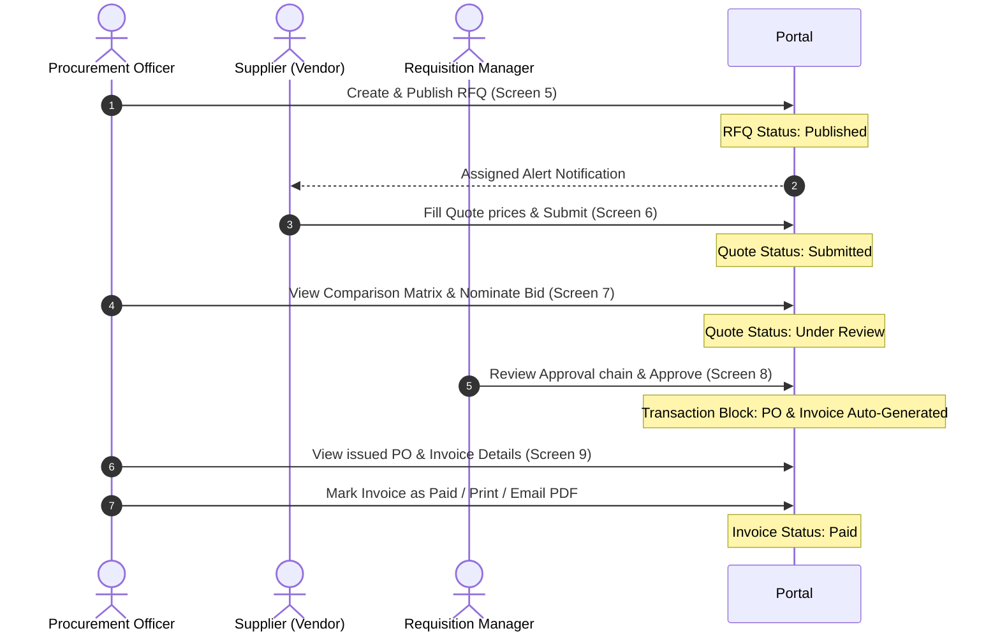

# App Flow & User Journeys

---

## 1. Primary User Journey: End-to-End Procurement Flow

The core procurement pipeline in VendorBridge follows a synchronous sequence of user states, dynamic screens, and transaction handoffs.

---

## 2. Page Navigation & Route Controls

The sidebar menu structure is role-aware and displays/hides links based on the active role selection.

### 2.1 Sidebar Navigation Links
*   **Dashboard** (Route: `/`): Shared overview dashboard. Displays different summary cards depending on active role permissions.
*   **Vendors** (Route: `/vendors`): Supplier directory. Visible to `Admin` and `Procurement Officer`.
*   **RFQs** (Route: `/rfqs`): List and creation. Officers see all RFQs + "+ New RFQ" wizard. Vendors only see RFQs they are invited to.
*   **Quotations** (Route: `/quotations`): Bidding inputs. Vendors submit quotes; Officers see submitted statistics.
*   **Approvals** (Route: `/approvals`): Workflow chain. Managers review pending requests; Officers track status.
*   **Purchase Orders** (Route: `/purchase-orders`): Contract directory. All roles can view related POs.
*   **Invoices** (Route: `/invoices`): Billing records. Officers pay/send bills; Vendors review outstanding balances.
*   **Reports** (Route: `/reports-analytics`): Charts and export utilities. Visible to `Admin`, `Officer`, and `Approver`.
*   **Activity** (Route: `/activity-logs`): Immutable audit ledger view. Visible to `Admin` and `Officer`.

---

## 3. Detail Workflow Steps

### 3.1 Step 1: RFQ Issuance
1.  **Procurement Officer** logs in, goes to **RFQs** page, and clicks **+ New RFQ**.
2.  Follows step wizard:
    *   *Step 1*: Enters title, description, category, and deadline.
    *   *Step 2*: Fills item detail table rows (Description, Qty, Unit type).
    *   *Step 3*: Selects suppliers checkbox list, uploads files, clicks **Publish**.
3.  System updates `rfqs` status to `Published` and appends a record to the `activity_logs` table.

### 3.2 Step 2: Quotation Submission
1.  **Vendor** logs in, goes to **Quotations** page, selects the published RFQ.
2.  Views the RFQ summary description and line items.
3.  Inputs unit prices per line, delivery days, custom notes, tax%, and reviews subtotal/grand total calculations.
4.  Clicks **Submit Quotation**. System updates `quotations` status to `Submitted` and logs action in `activity_logs`.

### 3.3 Step 3: Quotation Evaluation & Comparison
1.  **Procurement Officer** goes to **RFQs** page, opens the published RFQ details, and clicks **Compare Bids**.
2.  Views the side-by-side table displaying bid amounts, delivery timelines, payment terms, and vendor ratings.
3.  The lowest bid is highlighted in green. The Officer reviews and clicks **Select & Approve** on the preferred vendor bid.
4.  System updates bid status to `Under Review` and initiates the approval request.

### 3.4 Step 4: Multi-Level Approval
1.  **Approver/Manager** logs in, goes to **Approvals** page, selects the pending request.
2.  Examines approval history (e.g. L1 approved, L2 pending), proposal totals, item tables, and supplier performance.
3.  Inputs comments in the remarks textbox and clicks **Approve** (or **Reject**).
4.  If approved, the status is set to `Approved`. The system automatically generates a Purchase Order (`po_number`) and Invoice (`invoice_number`) in a single transaction, then logs the event to the immutable logs table.

### 3.5 Step 5: PO and Invoice Settlement
1.  **Procurement Officer** goes to **Purchase Orders** or **Invoices** page, selects the issued document.
2.  Views formal printable document layout (Bill to, Ship to, Line items details, tax calculations, payment status).
3.  Options:
    *   Click **Print** to open browser print dialog.
    *   Click **Export PDF** to fetch dynamic PDF binary stream.
    *   Click **Email Vendor** to send file attachment.
    *   Click **Mark as Paid** to update invoice state from `Generated` to `Paid`.
