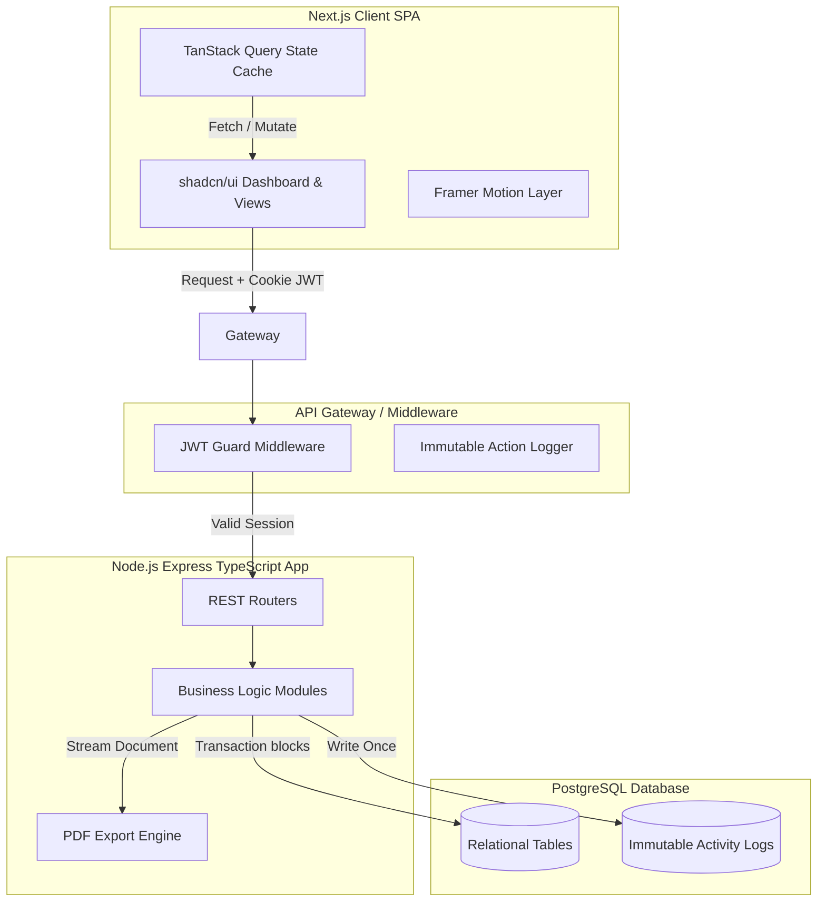

# Technical Requirements Document (TRD)

---

## 1. System Architecture & Component Mapping

The platform is designed around a decoupled client-server architecture consisting of a Next.js frontend application and a Node.js API backend connected to a PostgreSQL database instance.

---

## 2. Technology Stack Selection

### 2.1 Frontend Portal
*   **Framework**: Next.js 15 (App Router with TypeScript).
*   **Styling**: Tailwind CSS for responsive custom spacing and atomic layout values.
*   **UI Library**: shadcn/ui components (based on Radix UI and Tailwind CSS).
*   **State Management & Caching**: TanStack Query (React Query) for handling network request caching, queries, and optimistic mutations.
*   **Animations**: Framer Motion (`motion`) for layout animations, panel slide-overs, and multi-step form wizard transitions.
*   **Schema Validation**: Zod paired with React Hook Form.

### 2.2 Backend API
*   **Platform**: Node.js utilizing TypeScript.
*   **Framework**: Express.js (or NestJS) for lightweight routing.
*   **Database Client**: Prisma ORM or pg pool/Kysely for type-safe query building.
*   **Authentication**: JSON Web Tokens (JWT) signed with HS256 / RS256, issued via HttpOnly, Secure, and SameSite cookies.

### 2.3 Database
*   **Engine**: PostgreSQL (v15+) for transactions and JSONB flexibility.

---

## 3. Core API Specification

All endpoints are prefix-guarded by `/api/v1`.

### 3.1 Authentication Endpoint Matrix
*   `POST /auth/register`: Creates new user account. Returns profile info.
*   `POST /auth/login`: Validates credentials, sets HttpOnly token cookie.
*   `POST /auth/logout`: Clears HttpOnly cookies.
*   `GET /auth/me`: Retrieves current session user context.

### 3.2 Supplier Directory Endpoint Matrix
*   `GET /vendors`: List vendors with page pagination, search string, and tab filters (`All`, `Active`, `Pending`, `Blocked`).
*   `POST /vendors`: Admin registers a new vendor.
*   `PATCH /vendors/:id/status`: Admin/Officer toggles vendor status.

### 3.3 RFQ Endpoint Matrix
*   `GET /rfqs`: Lists active RFQs based on active role (Vendors only see assigned RFQs).
*   `POST /rfqs`: Procurement Officer publishes a new RFQ (creates records in `rfqs` and `rfq_vendors`).
*   `GET /rfqs/:id/quotations`: Officer views submitted quotations for comparison.

### 3.4 Quotation Endpoint Matrix
*   `POST /quotations`: Vendor submits a bid (records in `quotations` table). Calculates totals on backend to verify.
*   `GET /quotations/compare/:rfqId`: Officer compares bids side-by-side.
*   `POST /quotations/select`: Officer nominates a bid, transitioning the RFQ to `Closed` and starting the approval process.

### 3.5 Approval Workflow Endpoint Matrix
*   `GET /approvals`: Manager fetches active approvals queue.
*   `POST /approvals/:id/action`: Action is `Approved` or `Rejected`. Triggers a database transaction to auto-create the Purchase Order and Invoice if final approval criteria are met.

### 3.6 PO & Invoice Endpoint Matrix
*   `GET /purchase-orders/:id`: Fetch specific PO layout data.
*   `GET /invoices/:id`: Fetch invoice details.
*   `PATCH /invoices/:id/pay`: Mark payment status as `Paid`.
*   `GET /invoices/:id/pdf`: Streams invoice print PDF.

### 3.7 Audit Trail Endpoint Matrix
*   `GET /activity-logs`: Lists activity logs. **No POST, PUT, or DELETE routes exist for this resource.**

---

## 4. Database Transaction Integrity

> [!WARNING]
> Purchase Order and Invoice generation must execute within a unified database transaction block. If the L2 Manager approves the quotation, the PO and Invoice records must be generated atomically. If either insertion fails, the database must rollback to prevent orphaned PO/Invoice states.

---

## 5. Security Strategy

*   **CSRF Protection**: Access tokens are stored as `HttpOnly`, `Secure`, `SameSite=Strict` cookies. CSRF double-submit token headers are used for state-changing requests.
*   **XSS Mitigation**: Input sanitization via backend validators (Zod) and frontend JSX escaping.
*   **Rate Limiting**: Express Rate Limit applied on sensitive paths (`/auth/login`, `/auth/register`).
*   **Data Integrity Auditing**: DB triggers preventing update and deletion operations on the `activity_logs` table.
